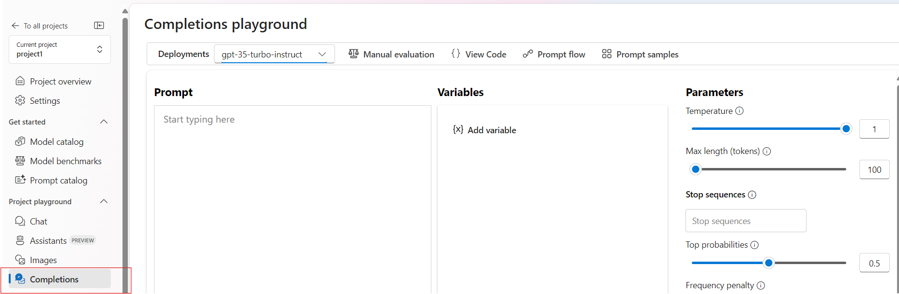

# Exercises

In this document, you find a few exercises for practicing prompt engineering. For each exercise, you'll get some input text and then an expected completion. You task is to write the prompt to achieve the expected completion.

Login using Azure AI Studio [https://ai.azure.com/] and Use `Completions` tab.

 a

##  Exercise 1 - German Translation

* Exercise: Write a prompt that generates the expected completion
* Input text: `I was enjoying the sun, but then a huge cloud came and covered the sky.`
* Expected completion: `Ich genoss die Sonne, aber dann kam eine riesige Wolke und bedeckte den Himmel.`

<details>
  <summary>See solution!</summary>

  ```
  Translate the following sentence into German.
    
  Sentence: I was enjoying the sun, but then a huge cloud came and covered the sky.
    
  German translation:
  ```

</details>

___

## Exercise 2 - Classification

* Exercise: Write a prompt that generates the expected completion
* Input text: `Not much to write about here, but it does exactly what it's supposed to. filters out the pop sounds. now my recordings are much more crisp. it is one of the lowest prices pop filters on amazon so might as well buy it, they honestly work the same despite their pricing.`
* Expected completion (or similar):
  ``` 
  Positive: 0.75
  Neutral: 0.20
  Negative: 0.05
  ```

<details>
  <summary>See solution!</summary>

  ```
  Not much to write about here, but it does exactly what it's supposed to. filters out the pop sounds. now my recordings are much more crisp. it is one of the lowest prices pop filters on amazon so might as well buy it, they honestly work the same despite their pricing

  Decide whether the product review's sentiment is positive, neutral or negative. Show the probability for positive, neutral and negative sentiment.
  ```

</details>

___

## Exercise 3 - E-Mail Summarization

* Exercise: Write a prompt that generates the expected completion
* Input text: 
```
Subject: Product Enquiry

Dear JJ,

I am writing to enquire about your [product name] and its availability. I came across your product on [website/store] and I am interested in purchasing it.

Could you please provide me with more information about the product, such as its features, specifications, and price? I would also like to know if there are any current promotions or discounts available.

Additionally, I would appreciate it if you could let me know about the delivery options and estimated
```
* Expected completion (or similar):
  ``` 
  Summary: XYZ
  Open Questions: XYZ
  Action Items: XYZ 
  ```

<details>
  <summary> See solution!</summary>

  ```
  I want you to summarize the following email thread using this format:
  [Summary:]
  [Open Questions:]
  [Action Items:]
  ```

</details>

___

##  Exercise 4 - Data extraction to JSON

* Exercise: Write a prompt that generates the expected completion
* Input text:
  ```
  Hello, my name is Mateo Gomez. I lost my Credit card on August 17th, and I would like to request its cancellation. The last purchase I made was of a Chicken parmigiana dish at Contoso Restaurant, located near the Hollywood Museum, for $40. Below is my personal information for validation:
  Profession: Accountant
  Social Security number is 123-45-6789
  Date of birth: 9-9-1989
  Phone number: 949-555-0110
  Personal address: 1234 Hollywood Boulevard Los Angeles CA
  ```
* Expected completion:
  ```
  {
      "reason": "Lost card",
      "name": "Mateo Gomez",
      "ssn": "123-45-6789",
      "dob": "09/09/1989"
  }
  ```

<details>
  <summary> See solution!</summary>

  ```
  This is an email from a customer. Extract the following information:
  - Reason for contact
  - Classified reason for contact (can be one of "lost_card", "account_closure", "address_change")
  - Name of customer
  - SSN
  - Date of birth
  Extract it as JSON with keys reason, name, ssn, dob. For dob, use MM/DD/YYYY formatting.
  Email:
  Hello, my name is Mateo Gomez. I lost my Credit card on August 17th, and I would like to request its cancellation. The last purchase I made was of a Chicken parmigiana dish at Contoso Restaurant, located near the Hollywood Museum, for $40. Below is my personal information for validation:
  Profession: Accountant
  Social Security number is 123-45-6789
  Date of birth: 9-9-1989
  Phone number: 949-555-0110
  Personal address: 1234 Hollywood Boulevard Los Angeles CA
  Result:
  ```

</details>

___


##  Exercise 5 - Write a Blog Post

* Exercise: Write a blog post about a emerging trends in e-commerce
* Input text: You choose
* Expected completion: a blogpost with attractive headline and list of emerging trends in e-commerce

<details>
  <summary>See solution!</summary>

  ```
 Write a catchy and creative listicle style blog on the topic of emerging trends in e-commerce that are shaping the future of retail. The blog should have a memorable headline and a clear call to action in the end encouraging the reader to engage further.
  ```

</details>

___


