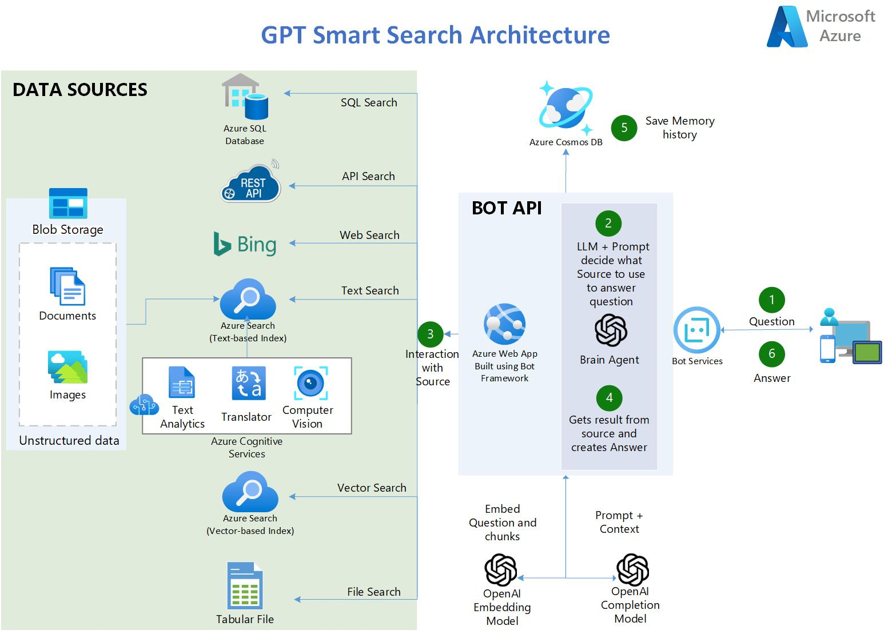

# Smart Chatbot using RAG and Agents

Lab Notebooks for the Azure OpenAI Workshop - Utilizing Your Data with Agents

## Architecture


## Flow
1. The user asks a question.
2. Using Langchain Agents, an OpenAI GPT-4 LLM uses a clever prompt to determine which source to use based on the user input
3. Five types of sources are available:
   * 3a.**Azure AI Search** - contains AI-enriched documents from Blob Storage:
       - 10,000 Arxiv Computer Science PDFs  
       - 90,000 Covid publication abstracts
       - 5 lenghty PDF books
    * 3b. **CSV Tabular File** - contains COVID-related statistics in the US.
    * 3c. **Azure SQL Database** - contains COVID-related statistics in the US.
    * 3d. **Azure Bing Search API** - provides access to the internet allowing scenerios like: QnA on public websites.
    * 3e. **API Endpoints**- RESTful OpenAPI 3.0 API containing up-to-date statistics about Covid.
4. The Agent retrieves the result from the source and crafts the answer.
5. The tuple (Question and Answer) is saved to CosmosDB as persistent memory and for further analysis.
6. The answer is delivered to the user.

## Deploy AI Services

1. Follow Steps listed in https://github.com/MSUSAzureAccelerators/Azure-Cognitive-Search-Azure-OpenAI-Accelerator?tab=readme-ov-file#steps-to-run-the-pocaccelerator

2. Copy files from `data/arxivcs` PDF files to container `arxivcs` in blob storage

3. Copy files from `data/cord19/metadata.csv` to container `cord19` in blob storage


## Step to run
1. Clone github repo to your AML Compute Instance or Visual Studio Code Editor.
 ```
git clone https://github.com/hifaz1012/AzureOpenAI-Workshop-Labs-1.git
 ```

2. Make sure you run the notebooks on a **Python 3.10 enviroment** or newer

3. If you are using Azure ML, activate conda environment
    ```
    conda activate azureml_py310_sdkv2
    ```

4. Edit the file `credentials.env_template` with your own values from the services created as part of deployment. Rename to `credentials.env'`
   
5. **Run the Notebooks in order**. They build up on top of each other.

## Reference
The source code has been taken from this repo : https://github.com/MSUSAzureAccelerators/Azure-Cognitive-Search-Azure-OpenAI-Accelerator and customized.